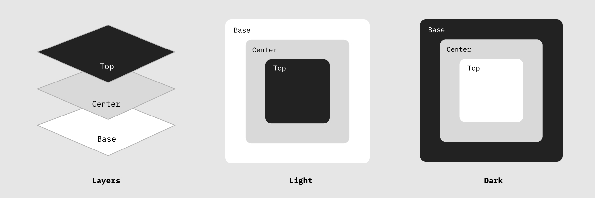

import Header from "../components/Header.astro";

import Palette from "../components/docs/color-usage-example.astro";
import Scale from "../components/docs/color-scale-example.astro";

<Header
  label="Core"
  title="Colors"
  description="A set of guidelines and rules that define how colors are used. This color system prioritises a limited set of monotone tints optimized for neutral, balanced and visual consistency. Through layering of the greyscale tints visual hierarchy can be created with sufficient contrast. Includes a palette and colors values."
/>

<section>
## Palette

The basis of my personal colors are a neutral _monochromatic_ grey color palette. It's a _spectrum_ of 8 tints and shades from white to black creating a grey color theme. Using these lighter neutral surface allows for varying with saturation to create a sense of hierarchy and elevation but also themes (e.g. light / dark mode) by inverting the spectrum.

## Scale

In the system of design tokens the tints are labelled in _hundreds_ better known as the _numeric weight scale_. The outermost colors on the spectrum are just **white** and **black**. Everything in between is a value between 100 and 900 to determine it's saturation.

<Palette />

### Digital

| Value | Name | Description                        | Token                  |
| ----- | ---- | ---------------------------------- | ---------------------- |
| baz   | bim  | Primary color used for backgrounds | `var(--color-primary)` |

### Pantone

| Value | Name | Description                        | Token                  |
| ----- | ---- | ---------------------------------- | ---------------------- |
| baz   | bim  | Primary color used for backgrounds | `var(--color-primary)` |

## Usage

To create visual hierarchy the grey tones are _layered_ for optical seperation. The **lighter** scale of the spectrum (~100/400) are often used as **background** colors such as page colors, shadows and borders. The **darker** scale of the spectrum (~400/800) are often used as **foreground** colors such as text colors or interactive components like buttons.

<Scale />

</section>
